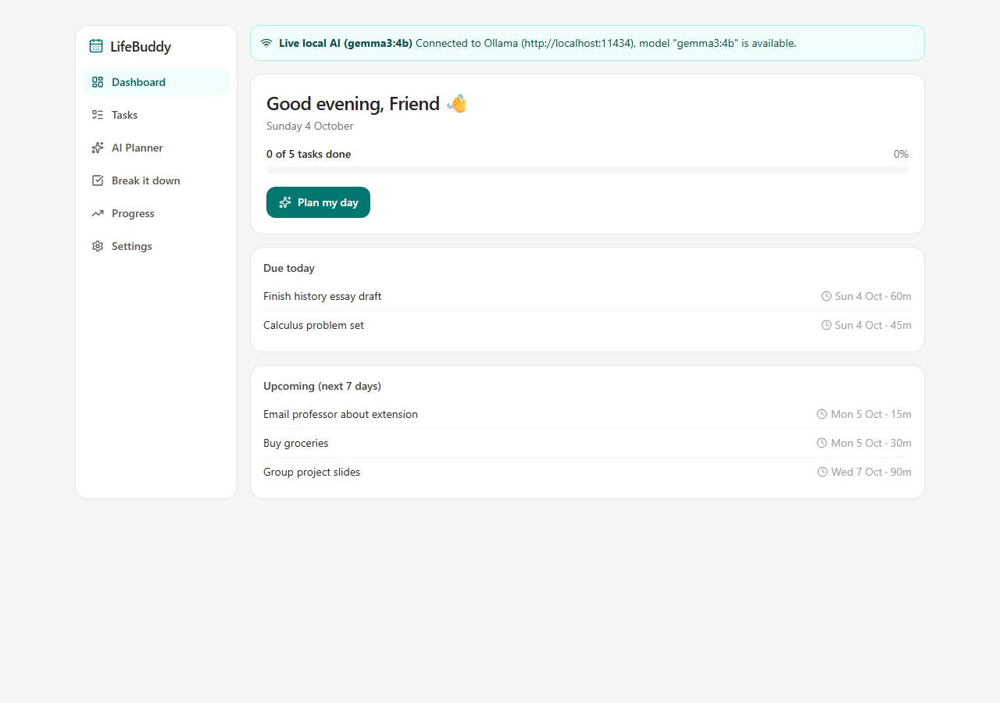
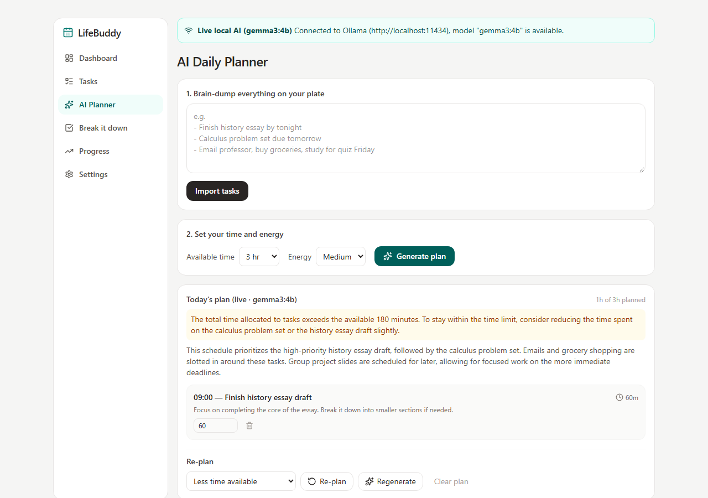
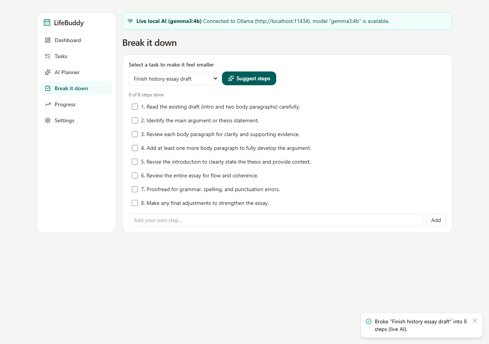
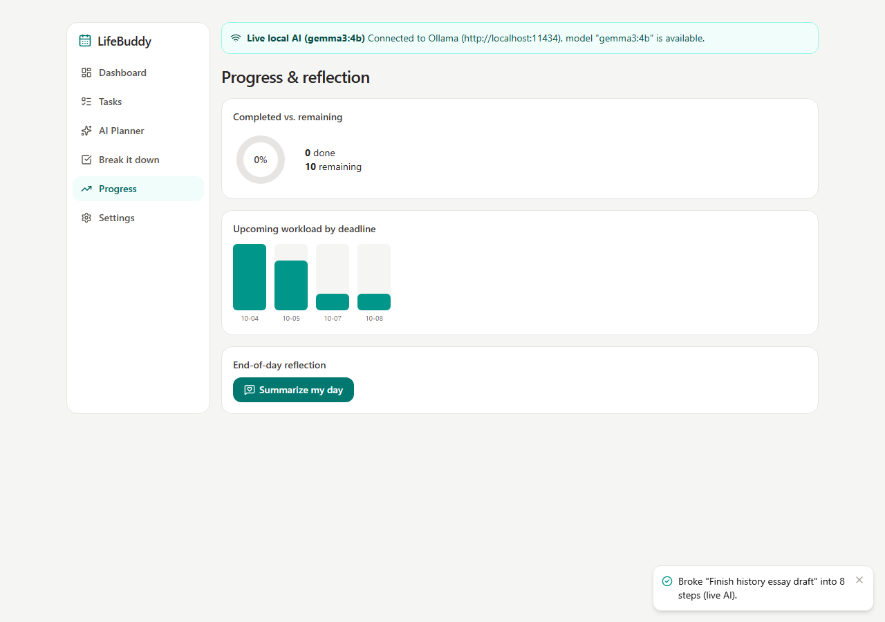
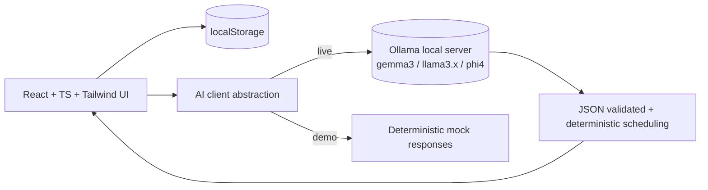

# LifeBuddy

> A calm, local-first AI companion that turns a messy student day into an achievable plan.

LifeBuddy was built for a hypothetical busy student friend: too many deadlines, too little energy, and a to-do list that feels bigger than the day. It helps them dump everything on their plate, shape it into a realistic daily plan with an open-weight local model, break scary tasks into small steps, re-plan when life happens, and end the day with an encouraging, honest summary.

Everything runs locally. Tasks and plans are stored in your browser's localStorage, and the AI runs on your own machine via [Ollama](https://ollama.com) — no paid API, no data leaving your laptop.

**Live demo:** https://yashspidey.github.io/lifebuddy/ (Demo mode — live AI needs local Ollama)









## Features

- **Dashboard** — personalized greeting, today's overview, overdue/due-today/upcoming tasks, progress bar.
- **Task management** — create, edit, complete, delete; filter by status and priority; overdue highlighting; persists across refreshes.
- **AI daily planner** — natural-language task dump → structured tasks; time + energy inputs; structured daily schedule with explanations, estimated durations, built-in breaks; overflow detection when the work exceeds the available time; accept/edit/remove any plan item; regenerate or get an adjusted plan via a re-plan reason.
- **Task breakdown** — pick a task and get practical, specific steps as an interactive checklist; add your own steps too.
- **Replanning** — "Less time available", "Low energy", "Unexpected task came up", etc. Completed work is preserved; nothing is silently deleted.
- **Progress & reflection** — completed vs. remaining donut, workload-by-deadline chart, optional AI end-of-day summary with honest, non-guilt-inducing language.
- **AI status & privacy** — banner shows live local AI vs. clearly-labeled demo mode, model errors, connection errors; localStorage data stays on your device; one-click data clearing.

## Architecture



- **Deterministic logic stays in code**: deadline ordering, time totals, overflow detection, and start-time calculation never come from the model. AI only proposes; the app validates and recomputes.
- **Validation first**: every model response is parsed defensively (`parseJsonLoose`), validated field-by-field, and malformed output produces a friendly error — never a silent bad state.
- **Graceful fallback**: if Ollama isn't reachable, the app falls back to a built-in demo mode that is clearly labeled in the UI. Live mode is never faked.

## Tech stack

- React 19, TypeScript, Vite
- Tailwind CSS 4, Lucide icons
- Ollama HTTP API (`/api/generate`, `format: json`)
- Persistence: localStorage (local-first, no backend required)
- Tests: Vitest + React Testing Library

## Setup (Windows PowerShell)

```powershell
# 1. Install dependencies
npm install

# 2. (Optional) configure AI
Copy-Item .env.example .env

# 3. Run in demo mode (no Ollama needed)
npm run dev
```

Open http://localhost:5173 — the app will show a "Demo mode" banner.

### Enabling live local AI

```powershell
# Install Ollama from https://ollama.com, then:
ollama pull gemma3:4b     # or your preferred open-weight instruct model
ollama serve              # usually starts automatically on Windows
```

Allow the browser origin so the frontend can call Ollama (one-time, in PowerShell before starting Ollama):

```powershell
setx OLLAMA_ORIGINS "http://localhost:5173,http://localhost:4173"
```

Restart Ollama, refresh the app, and the banner should read **Live local AI**.

### Other scripts

```powershell
npm test          # run the Vitest suite
npm run build     # type-check + production build to dist/
npm run preview   # serve the production build locally
npm run lint      # oxlint
```

## Environment variables

| Variable | Default | Purpose |
| --- | --- | --- |
| `VITE_OLLAMA_BASE_URL` | `http://localhost:11434` | Local Ollama server |
| `VITE_OLLAMA_MODEL` | `gemma3:4b` | Model used for parsing/planning |

## Challenge prize tracks

Relevant tracks that this project genuinely fits:

- **Best Use of Gemma** — the core AI features (task parsing, daily planning, task breakdown, replanning, day summaries) run on a local Gemma model via Ollama.
- **Best Use of Render** — `render.yaml` deploys the built static frontend (Demo mode, since live AI needs your local Ollama).

Other partner tracks were intentionally not used, because shipping a fake integration just to qualify would violate the project's core principle.

## Deploying the demo

A `render.yaml` blueprint is included — on Render, the built static site can be deployed in one click (it will run in Demo mode there, since live AI needs your local Ollama server).

## Privacy & data

- Tasks, plans, and your display name live only in this browser's localStorage.
- In live mode, prompts are sent only to your own Ollama server on your machine.
- Settings → "Clear all local data" wipes everything and reloads sample tasks.

## Known limitations

- No sync across devices or accounts (by design, local-first).
- Plan quality depends on the chosen local model; malformed output is handled with a visible error and a Regenerate button.
- Browser automation visual checks were not run in this environment; run `npm run dev` and follow `docs/DEMO_SCRIPT.md` to verify the experience.

## Future improvements

- IndexedDB for larger histories, weekly stats charts.
- Calendar (ICS) import for deadlines.
- More Ollama model presets, configurable temperature.
- PWA install + offline checklist.
